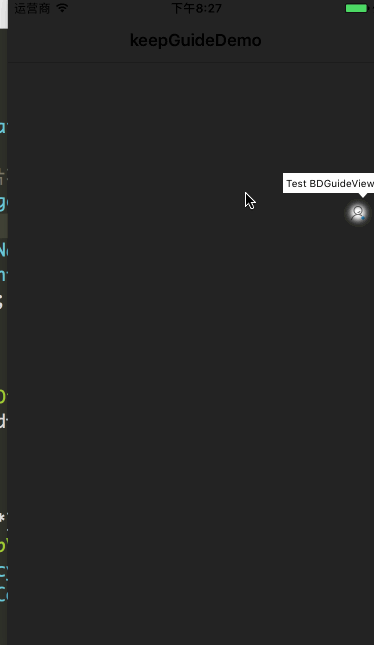

#  KeepGuide   


##1.说明 可以一行代码实现新手引导界面常见文本提示(带箭头)




### 1.1只显示一次已经内部处理,你只需要告诉我坐标和文本即可.

```
[BDGuideView showDirection:BDArrowDirectionDown1 frame:CGRectMake(100, 100, 100, 20) text:@"测试只是文字显示"];

```
## 2.对于keep 有点亮效果图标 + 文本提示.处理方案不是太好,但是也实现了,如果你有好的实现方案可以联系我,我再改下

### 2.1 目前是公司UI重新切图,采取蒙版上覆盖新图方式,因为项目需求,有二个方法,一个是图标原图模式,一个是居中显示.

```
 [BDGuideView showDirection:BDArrowDirectionDown2 frame:CGRectMake((ScreenWidthFB)/2 - 22 , ScreenHeightFB - 44,100, 20) currentVC:self imageFrame:CGRectMake((ScreenWidthFB)/2 , ScreenHeightFB - 44,100, 20) imageName:nil text:@"引导，从这里开始."];

```


# 3.Requirements

This library requires iOS 6.0+ and Xcode 6.0+.

# 4. 有任何问题，请及时 issues me

<dragonli_52171@163.com>
