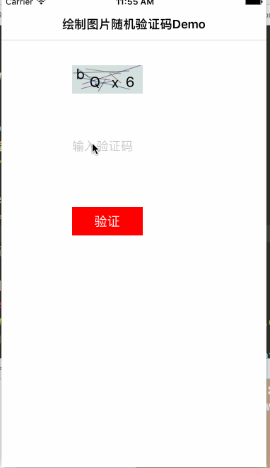

#LFLRandomCodeView 绘制图片随机验证码

## 1.效果图



##2.代码部分说明,只需要给个位置即可

```
1. 一行创建
  _randomCodeView = [[LFLRandomCodeView alloc] initWithFrame:CGRectMake(begainX, 100, 100, 40)];

2. 用户点击确认是否输入正确 block 回调结果,处理即可 
- (void)makeSureHandele{
    __weak typeof(self) ws=self;
    [_randomCodeView isInputCorrectWithString:_textField.text :^(NSString *statusSTring) {
        UIAlertView * alertView= [[UIAlertView alloc]initWithTitle:nil message:statusSTring delegate:ws cancelButtonTitle:@"取消" otherButtonTitles:@"确定", nil];
        [alertView show];
    }];
}


```
  
Requirements
==============
This library requires `iOS 6.0+` and `Xcode 6.0+`.

# 3. 有任何问题，请及时 issues me 
 <dragonli_52171@163.com>   