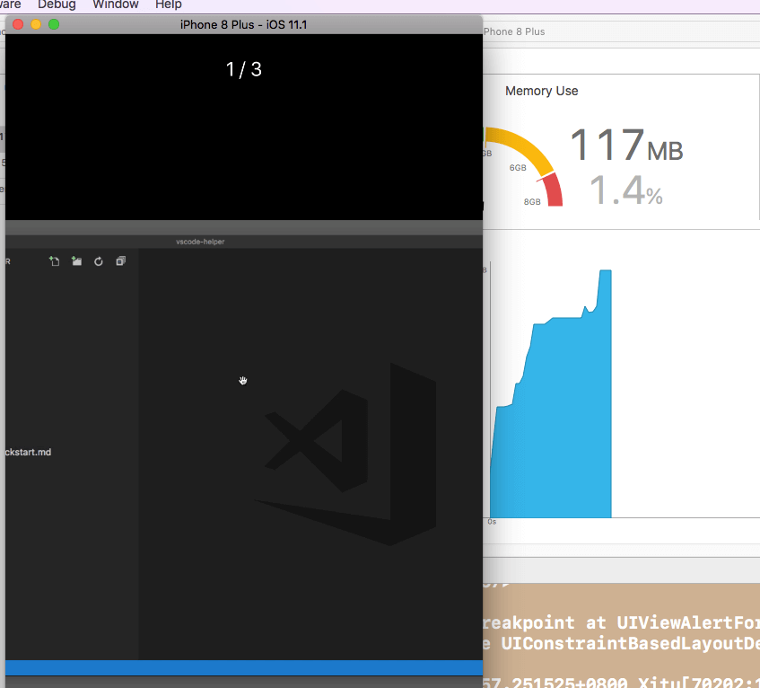
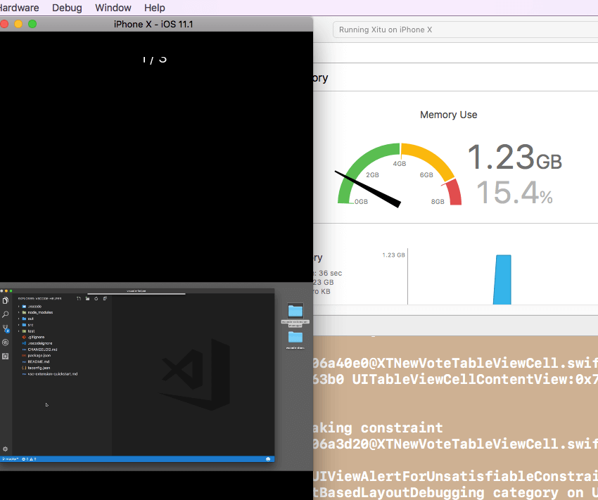

# GIF内存优化处理

### 对于旧项目,采用 sdwebimage 4.0以下版本,一般遇到大一点 gif 会崩溃

### 解决方式,此 GIF加载后,通过此方式,占用内存为50mb内

```

1. LFLImageView 替换项目中的UIImageView

2. 涉及加载图片,使用如下 

 NSURL *URL = [NSURL URLWithString:@"https://user-gold-cdn.xitu.io/2017/11/9/62dee318aba6a80a31d5a35c15cdd977?"];
[self.pic LFL_setImageWithURL:URL placeholderImage:nil progress:^(CGFloat progress) {
    NSLog(@"%f",progress);
} completed:^(UIImage *image, NSError *error, SDImageCacheType cacheType, NSURL *imageURL) {
    NSLog(@"size = %@,data = %@",NSStringFromCGSize(image.size),image);
}];


```

### 掘金项目中涉及的 pic  example 

- 

- 

Requirements
==============

library requires `iOS 6.0+` and `Xcode 6.0+`.


# 3. 有任何问题，请及时 issues me 
 <dragonli_52171@163.com>   