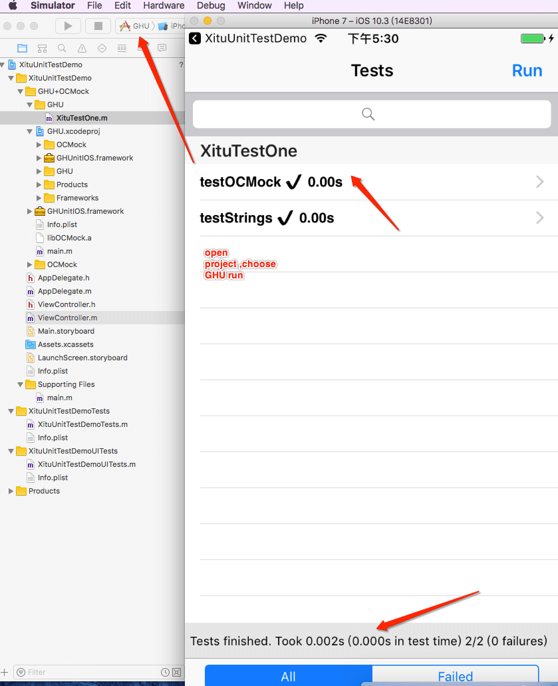

# iOS Dev Demo code Note 

 
## Stargazers over time

* 详细细节还需要看各demo文件夹说明

| CATEGORY | FILE |  
|:----|:----|
| NOTE |[iOS经典Crash分析与总结：QQ](iOS经典Crash分析与总结：QQ/readme.md) [GCD](./GCD_Demo) [KVO](./KVO) [InterviewExampleCode](./InterviewExampleCode)|
| DevDemo |[iOS项目完全解耦的**Debug菜单中心组件**](https://github.com/DevDragonLi/iOSDebugKit) [**ProtocolServiceKit组件中间件**](https://github.com/DevDragonLi/ProtocolServiceKit) [一个利用OCMock+GHU进行单元测试的Demo](./1-DevDemo/XituUnitTestDemo) [sharedInstanceDemo&&destroy](./1-DevDemo/sharedInstanceDemo) [一个简单私有化pod的demo](./1-DevDemo/PodPrivate_demo) [ReactiveObjCDemo-早期code](./1-DevDemo/ReactiveObjCDemo) [列表预加载处理方案](./1-DevDemo/preloadListData) [CodeSnippets && FaceID&&TouchID](./1-DevDemo)|
| UIDemo |[**适配暗黑模式组件Demo**](https://github.com/DevDragonLi/LFLDarkModeKit) **多图选择器(带内置拍照)demo**[XTPhotoPicker](./3-UIDemos/XTPhotoPicker/readme.md) [LFLRandomCodeView绘制图片随机验证码](./3-UIDemos/LFLRandomCodeView) [高仿对于keep有点亮效果实现(文本各方向箭头tips)](./3-UIDemos/KeepGuide) [简单封装拍照相册选取工具&&相关涉及代码](/3-UIDemos/CameraAndPhotoAlbumDemo/readme.md) [头像点击查看大图和保存功能DemoOC版本](./3-UIDemos/LFLHeadimageBrowserDemo),[Swift版本](https://github.com/DevDragonLi/SwiftCodeRepo/tree/master/LFLHeadimageBrowserDemo) [TableViewCell依次插入动画](./3-UIDemos/TableViewCell依次插入动画)|
| AdapteriOS |[iOS-adapter-iPhoneX](./2-AdapteriOS/iOS-adapter-iPhoneX.md) [掘金客户端AdapteriOS11](./2-AdapteriOS/README.md) [iOS11-TabBar跳跃解决方案](./2-AdapteriOS/iOS11_TabBar.md) [more content details](./2-AdapteriOS) |
| 项目GIF有关处理和优化 |[对于旧项目,采用 sdwebimage 4.0以下版本,可以参考 demo](./4-GIFDemos/GIF-Optimize)  [相册选取 GIF处理,展示,解决浏览和优化内存占用问题](./4-GIFDemos/handle_Album_Select_GIF_Demo)|

##   Example_GIF 

Requirements
==============

library requires `iOS 6.0+` and `Xcode 6.0+`.

# 有任何问题，请及时 issues me

> dragonli_52171@163.com
