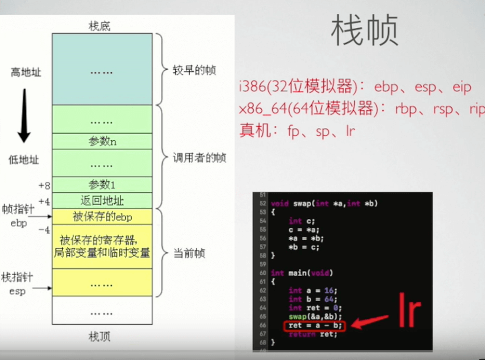
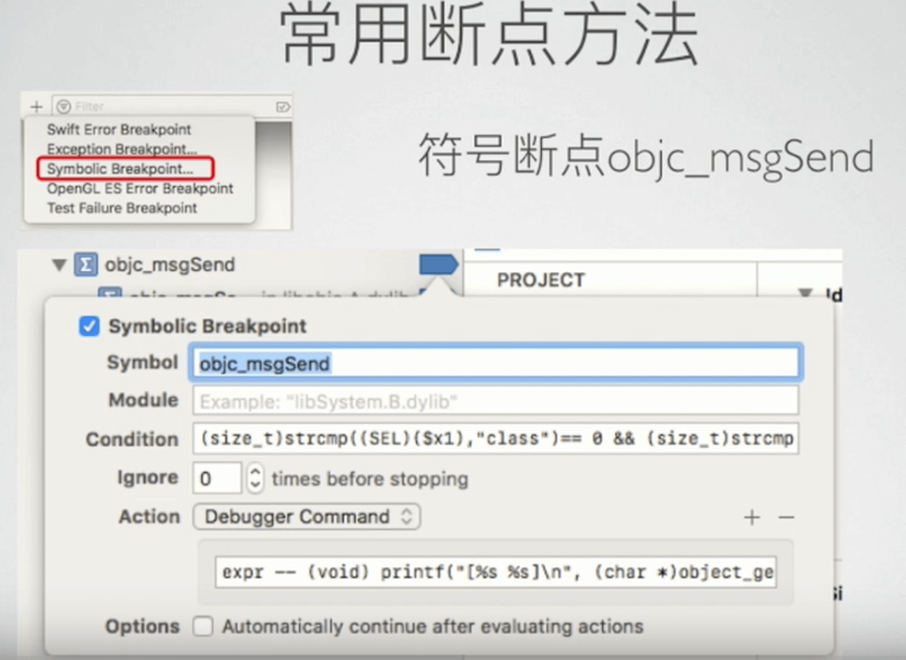
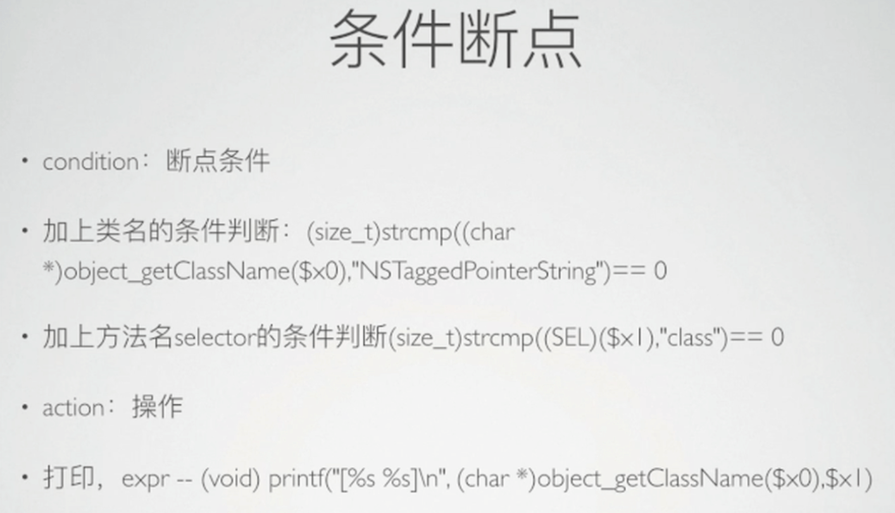
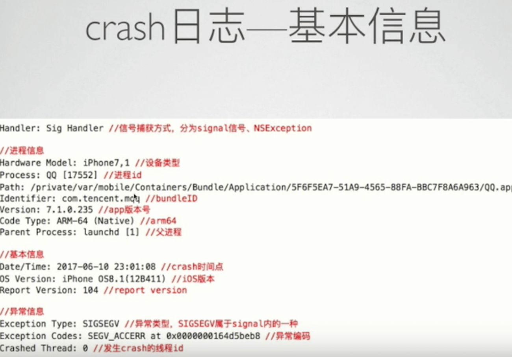
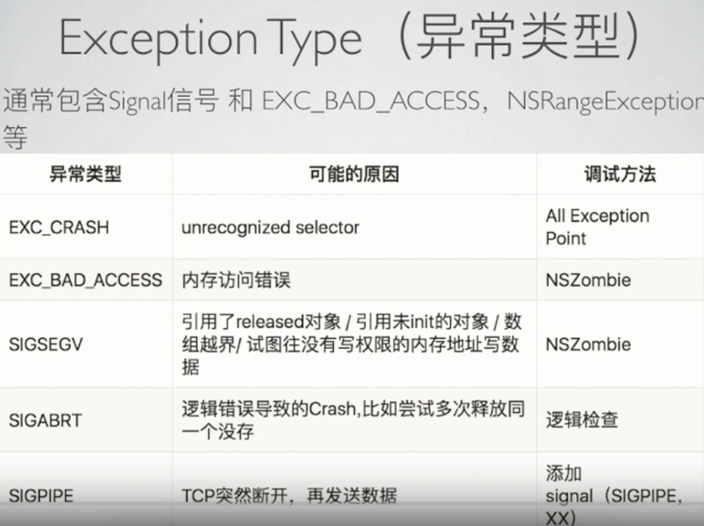
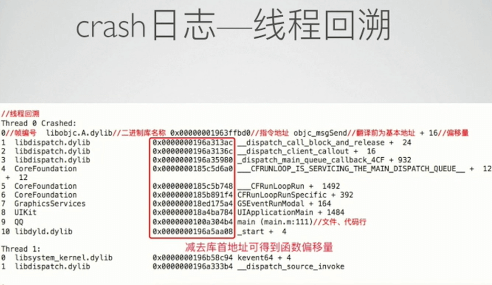
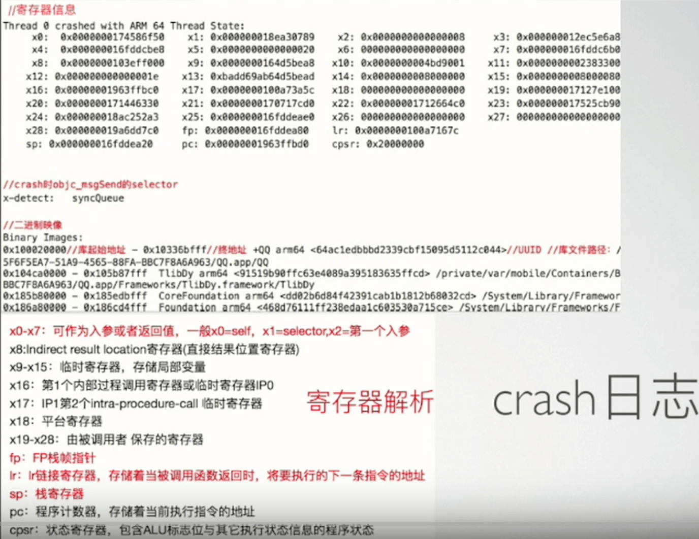

# iOS经典Crash分析与总结 

来源 QQ MelonTeam [link](https://ke.qq.com/webcourse/index.html#course_id=235828),涉及图片见文章底部 

- 基础知识
- 经典案例
- 常见crash点
- 总结

## base 

- crash 日志
	- 基本信息	(异常类型,编码)
	- 线程回溯 (减去对应库首地址,得到偏移量->函数)
	- 分析对应的寄存器解析

- 栈帧 
- Binary Images 二进制库文件 
- 常用断点方法  && 常用工具
	- 
	- 
	- 反汇编 hopper  (IDA)
	- 堆栈翻译工具
	- Xcode 命令 :symbolicatecrash  atos
	- GearCrash 工具

## 经典案例

### lr地址定位

### 卡死

### 野指针

## pic 

- 
- 
-  
- 
- 